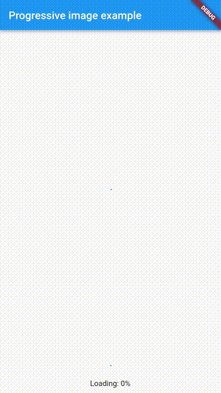

# flutter_progressive_image

[](https://pub.dartlang.org/packages/flutter_progressive_image)
[](https://github.com/fingerart/flutter_progressive_image/stargazers)
[](https://github.com/fingerart/flutter_progressive_image/network)
[](https://github.com/fingerart/flutter_progressive_image/blob/main/LICENSE)
[](https://github.com/fingerart/flutter_progressive_image/issues)

语言: [English](./README.md) | 中文简体

<br/>

一个Flutter渐进式图片加载组件。

## 预览

| 渐进式                                                             | 普通                                                      |
|-----------------------------------------------------------------|---------------------------------------------------------|
|               |               |
| 📺 [progressive image demo video](./arts/progressive_image.mp4) | 📺 [general image demo video](./arts/general_image.mp4) |

## 支持的图片格式

- [x] jpeg/jpg
- [ ] png
- [ ] gif

## 使用方式

```yaml
dependencies:
  flutter_progressive_image: ^0.0.2
```

```dart
Image(
  image: ProgressiveImage(url),
)
```

## 支持参数

| 参数          | 可选择性   | 说明      |
|:------------|:-------|---------|
| url         | **必选** | 图片路径    |
| headers     | 可选     | Http请求头 |
| imageLoader | 可选     | 图像底层加载器 |


⚠️【注意】默认的`imageLoader`不支持持久化缓存